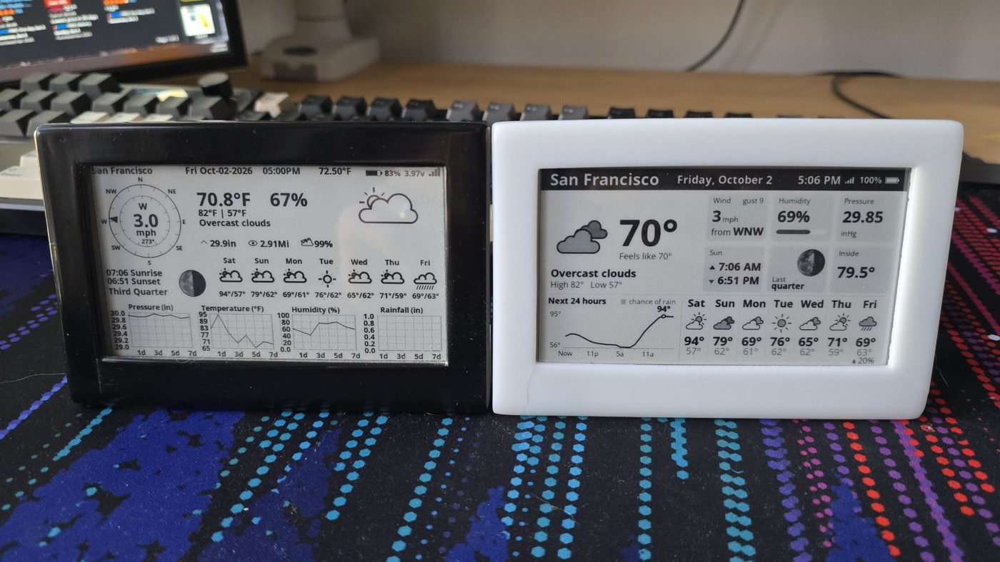
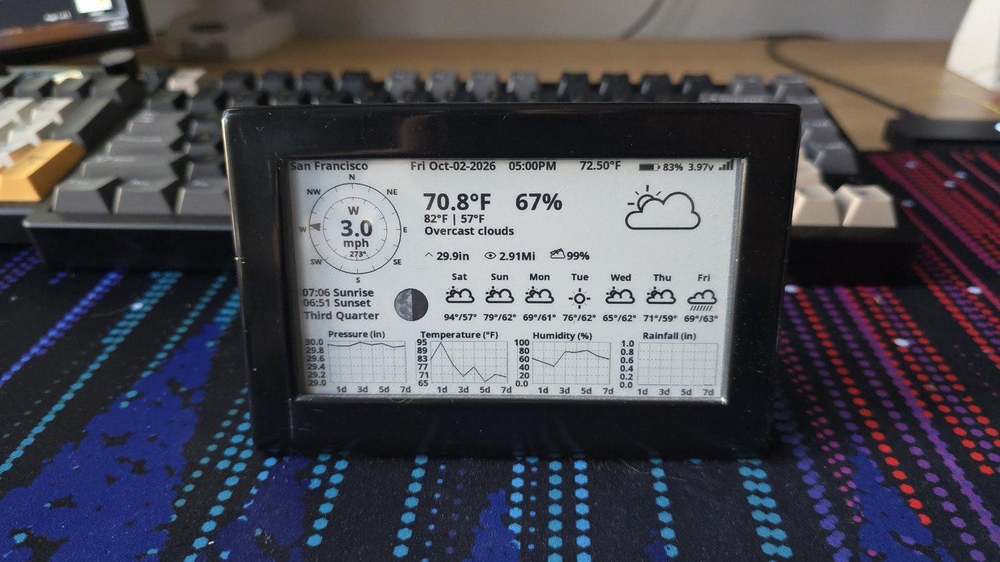

# Changelog

## v2.0.0 (October 2026)

A ground-up rewrite. Nothing from v1's code was carried over: new firmware, new layout and new tooling, built with PlatformIO instead of the Arduino IDE.

*v1 on the left, v2 on the right, showing the same forecast.*

### Display

- **New layout:**
  - A black header bar shows the place name, date, last update time, Wi-Fi signal and battery level.
  - A large "now" panel shows the icon, temperature, feels-like, description and today's high and low.
  - Six detail tiles, a 24-hour chart and a 7-day outlook fill the rest of the screen.
- **24-hour chart** with hourly temperature and chance of rain. It replaces v1's four small 7-day graphs (pressure, temperature, humidity and rainfall).
- **7-day outlook** now includes a chance of rain for each day.
- **New readings:** feels-like temperature, wind gusts, and UV index (shown when no probe is fitted).
- **Wind** shows the speed with its direction in words (e.g. "from WNW") instead of the compass rose.
- **Moon tile:** the moon photo is shaded on the device to match the current phase, with the phase name next to it.
- **Inside temperature** from the DS18B20 probe gets its own tile, instead of a number in the header.
- **Weather icons** are drawn in code with anti-aliasing, using the panel's grey levels: shaded clouds, storms, sleet, fog and a night moon.
- **Fonts:** Open Sans, regenerated in more sizes by `tools/make_fonts.py`.
- **New screens:** an "Offline" note when an update fails (the last forecast stays up), and a "Waiting for weather" screen that explains why it has no forecast yet (no Wi-Fi, rejected API key, API limit reached).

### Weather data

- Moved to **OpenWeatherMap One Call 3.0**, since the 2.5 API v1 used has been shut down. One request now returns current conditions, hourly and daily data.
- The response is streamed through a filter, so only the needed fields are kept in memory.
- The clock is set from the server's response, so there's no separate NTP sync on every wake.

### Battery life

- **Update schedule:** every 15 minutes from 06:00 to 16:45, every 30 minutes from 17:00 to 22:00, then asleep until morning. That's about 55 wakes a day, down from about 70. The schedule is configurable in `config.h`.
- **Skips the panel refresh** when nothing on screen has changed apart from the update time.
- **Fast Wi-Fi reconnect** using the access point's saved channel and BSSID, with an optional static IP.
- **After a failed update** it retries with backoff during the day (5, 10, 20… minutes) and doesn't retry at all overnight.
- **Battery reading:**
  - Taken before Wi-Fi starts, so the voltage isn't sagging under load.
  - Uses the median of 31 samples, smoothed across wakes.
  - Shown in 5% steps, with a calibration factor in `config.h`.

### Setup and configuration

- **PlatformIO project** with the board settings and libraries pinned in `platformio.ini`.
- Wi-Fi details, the API key and your exact location live in `include/secrets.h`, which is git-ignored and so can't be committed by accident.
- Units, 12/24-hour clock, header style, schedule, pins and battery calibration are all set in `include/config.h`.
- `tools/preview/` renders the screen layout on a PC, so the layout can be checked without flashing. It also produces the README screenshots.

## v1 (June 2024)

The first version was an Arduino IDE sketch based on David Bird's (G6EJD) LilyGo 4.7" OpenWeatherMap weather display, which inspired this project. His original copyright notice is kept with that code, at the `v1.0` tag.

- **Weather data:** OpenWeatherMap One Call 2.5.
- **Layout:**
  - Wind compass rose
  - Current conditions with high and low
  - Sunrise and sunset
  - Moon phase
  - 7-day icons with highs and lows
  - Four 7-day graphs: pressure, temperature, humidity and rainfall
- **Header:** inside temperature from a DS18B20 probe, plus battery percentage and voltage.
- **Updates:** every 15 minutes, with no updates from 23:30 to 06:00.
