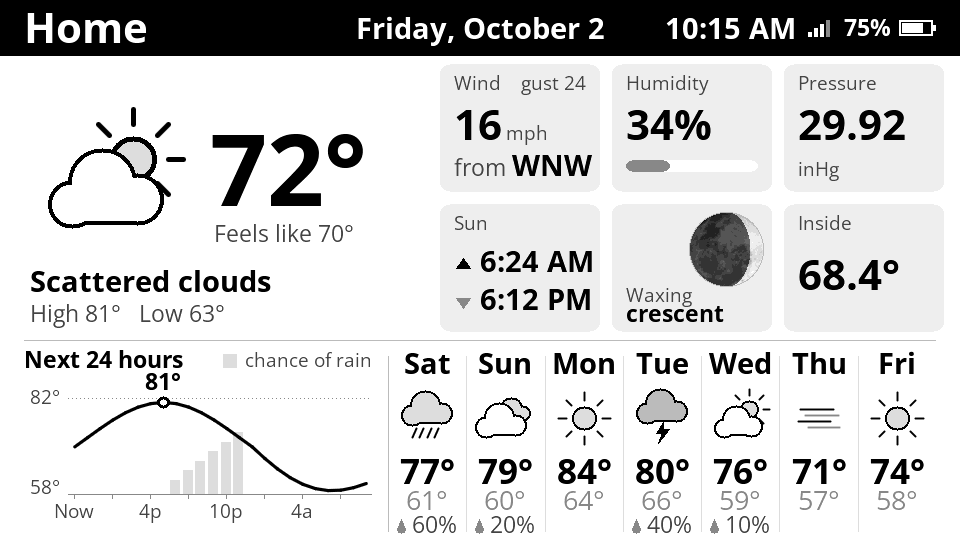

# E-Ink Weather Display

A battery-powered weather dashboard for the **LilyGo T5 4.7" e-paper board** (ESP32 + 960x540, 16-level greyscale). Every 15 minutes it wakes up, pulls the forecast from OpenWeatherMap, reads a local temperature probe, redraws the panel, and goes back into deep sleep. E-paper keeps its image with no power, so the display stays readable between updates while the board draws almost nothing.

*Rendered from the firmware's own drawing code with sample data. See [tools/preview](tools/preview).*

<!-- PHOTOS: add a photo of the finished display here, e.g.  -->

## What's on the screen

- **Header:** place name, date, time of the last update, Wi-Fi signal and battery level
- **Now:** a large condition icon, the temperature, "feels like", a description, and today's high and low
- **Detail tiles:**
  - Wind speed, direction (e.g. "from WNW") and gusts
  - Humidity
  - Pressure
  - Sunrise and sunset
  - Moon phase: a moon photo shaded to match tonight's moon
  - Inside temperature from the probe on the display, or the UV index if no probe is fitted
- **Next 24 hours:** temperature curve over hourly chance-of-rain columns, with the warmest hour marked
- **Next 7 days:** icon, high, low and chance of rain

## Behaviour

- **Schedule:** every 15 minutes from 06:00 to 16:45, every 30 minutes from 17:00 to 22:00, then asleep until 06:00. That's about 55 updates a day. Change `UPDATE_WINDOWS` in `config.h` to adjust.
- **Only refreshes when something changed.** Each wake draws the new screen in memory and compares it with what's already on the panel. If only the update time would differ, the panel is left alone, saving the refresh. So the time in the header shows when the display last changed.
- **Fast wake:** Wi-Fi reconnects using the access point's channel and BSSID saved from the last wake, skipping the scan. A fixed IP can also skip DHCP (optional, in `config.h`). The clock is set from the weather server's response, so there's no separate time sync.
- **If an update fails** (Wi-Fi down, API error), the last good forecast is redrawn from RTC memory with an "Offline" note. It then retries after 5, 10, 20… minutes during the day, and waits for the morning at night.
- **Battery reading** is taken right after waking, before Wi-Fi loads the battery. It's the median of 31 samples, smoothed across wakes and shown in 5% steps. For best accuracy, calibrate it against a multimeter with `BATTERY_CALIBRATION`.

## Hardware

| Part | Notes |
|---|---|
| LilyGo T5 4.7" (ESP32-WROVER, PSRAM) | The framebuffer lives in PSRAM |
| DS18B20 temperature probe (optional) | Data on **GPIO 15** with a 4.7k pull-up to 3V3. Without it, the tile shows UV index instead. |
| 1-cell LiPo | Read through the board's divider on **GPIO 36** |

## Setup

1. Install [PlatformIO](https://platformio.org/) (the VS Code extension is easiest).
2. Get an [OpenWeatherMap](https://openweathermap.org/api/one-call-3) API key and subscribe it to **One Call API 3.0**. The free tier includes 1,000 calls a day, and this display uses about 70.
3. Copy `include/secrets.example.h` to `include/secrets.h`, then fill in your Wi-Fi details, API key and location. `secrets.h` is gitignored, so none of these end up on GitHub.
4. Edit `include/config.h`:
   - Units (imperial or metric)
   - 12/24-hour clock, update interval and quiet hours
5. `pio run -t upload`, then `pio device monitor` to watch the log.

## Project layout

| Path | What it does |
|---|---|
| `src/main.cpp` | Wake → connect → fetch → draw → sleep, plus offline fallback |
| `src/owm.*` | One Call 3.0 request, streamed and filtered JSON parsing |
| `src/weather.h` | Forecast data model and condition-code mapping |
| `src/screen.*` | Dashboard layout |
| `src/icons.*` | Weather icons and status glyphs (drawn in code), and the moon |
| `src/moon_image.h` | Moon photo used by the moon tile |
| `src/canvas.*` | Drawing layer over the e-paper framebuffer |
| `src/net.*` | Wi-Fi and NTP time |
| `src/power.*` | Battery voltage, sleep scheduling |
| `src/probe.*` | DS18B20 reading |
| `src/fonts/` | Generated Open Sans bitmap fonts |
| `tools/make_fonts.py` | Regenerates `src/fonts/` from the TTFs in `assets/fonts/` |
| `tools/preview/` | Renders the layout to a PNG on a PC |

## Credits

Inspired by the many ESP32 e-paper weather displays in the maker community. Uses the [LilyGo EPD47](https://github.com/Xinyuan-LilyGO/LilyGo-EPD47) driver, [ArduinoJson](https://arduinojson.org/), the OneWire and DallasTemperature libraries, and weather data from [OpenWeatherMap](https://openweathermap.org/). The fonts are generated from [Open Sans](https://fonts.google.com/specimen/Open+Sans), which is under the SIL Open Font License (`assets/fonts/OFL.txt`).
